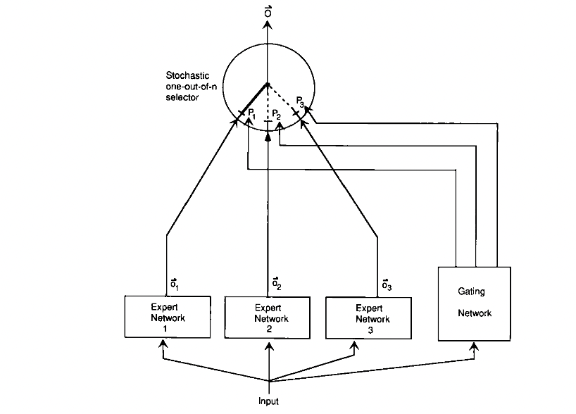
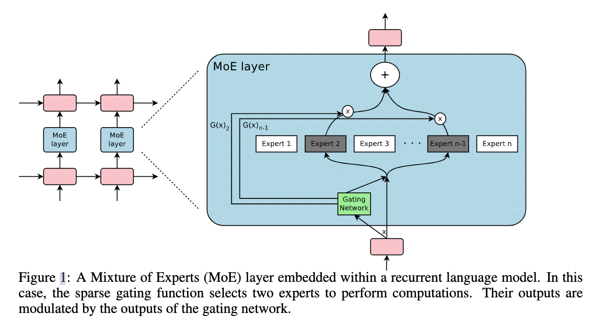
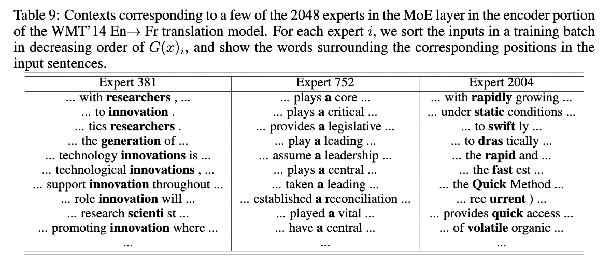
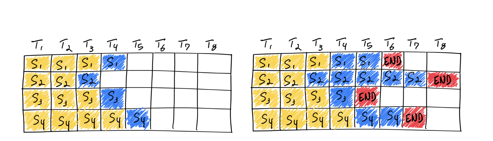
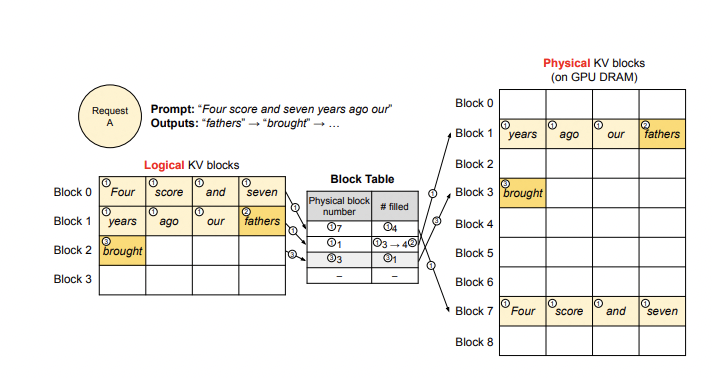
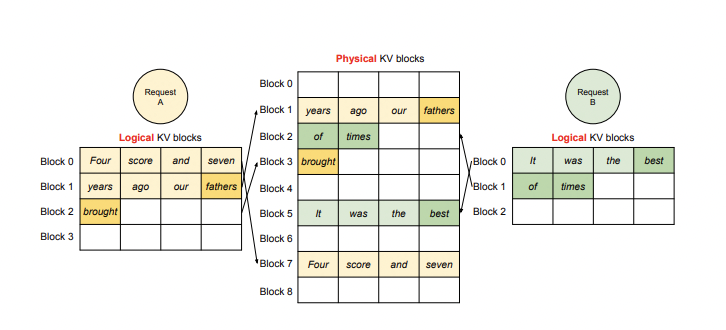

## 9.28 -- 10.11
### 9.29
#### MoE开创工作

##### 1. Adaptive mixtures of local experts, Neural Computation'1991

提出了一种新的监督学习过程，**一个系统中包含多个分开的网络，每个网络去处理全部训练样本的一个子集**。这种方式可以看做是把多层网络进行了**模块化的转换**。

假设我们已经知道数据集中存在一些天然的子集（比如来自不同的domain，不同的topic），那么用单个模型去学习，就会受到很多干扰（interference），导致学习很慢、泛化困难。这时，我们可以使用多个模型（即专家，expert）去学习，使用一个门网络（gating network）来决定每个数据应该被哪个模型去训练，这样就可以减轻不同类型样本之间的干扰。

其实这种做法，也不是该论文第一次提出的，更早就有人提出过类似的方法。对于一个样本 c，第 i 个 expert 的输出为 $\mathbf{o}_i^c$，理想的输出是 $\mathbf{d}^c$，那么损失函数就这么计算：

$$
\mathrm{E}^{\mathrm{c}}=\left\|\mathbf{d}^{\mathrm{c}}-\sum_{\mathrm{i}} \mathrm{p}_{\mathrm{i}}^{\mathrm{c}} \mathbf{o}_{\mathrm{i}}^{\mathrm{c}}\right\|^{2}
\tag{1}
$$

其中 $p_i^c$ 是 gating network 分配给每个 expert 的权重，相当于多个 expert 齐心协力来得到当前样本 c 的输出。

这是一个很自然的设计方式，但是存在一个问题——**不同的 expert 之间的互相影响会非常大**，一个expert的参数改变了，其他的都会跟着改变，即所谓牵一发而动全身。这样的设计，最终的结果就是一个样本会使用很多的expert来处理。于是，这篇文章设计了一种新的方式，**调整了一下loss的设计，来鼓励不同的expert之间进行竞争**：

$$
E^{\mathrm{c}}=\sum_{i} p_{i}^{c}\left\|\mathbf{d}^{c}-\mathbf{o}_{i}^{\mathrm{c}}\right\|^{2}
\tag{2}
$$

就是**让不同的 expert 单独计算 loss，然后在加权求和得到总体的 loss**。这样的话，每个专家，都有独立判断的能力，而不用依靠其他的 expert 来一起得到预测结果。下面是一个示意图：



在这种设计下，我们将 experts 和 gating network 一起进行训练，最终的系统就会倾向于让一个 expert 去处理一个样本。

上面的**两个 loss function，其实长得非常像，但是一个是鼓励合作，一个是鼓励竞争**。这一点还是挺启发人的。

论文还提到另外一个很启发人的 trick，就是上面那个损失函数，作者在实际做实验的时候，用了一个变体，使得效果更好：

$$
Original : \mathrm{E}^{\mathrm{c}}=\sum_{i} \mathrm{p}_{\mathrm{i}}^{\mathrm{c}}\left\|\mathbf{d}^{\mathrm{c}}-\mathbf{o}_{\mathrm{i}}^{\mathrm{c}}\right\|^{2}
\tag{3}
$$

$$
Modified : \mathrm{E}^{\mathrm{c}}=-\log \sum_{\mathrm{i}} \mathrm{p}_{\mathrm{i}}^{\mathrm{C}} \mathrm{e}^{-\frac{1}{2}\left\|\mathrm{~d}^{\mathrm{c}}-\mathbf{o}_{\mathrm{i}}^{\mathrm{c}}\right\|^{2}}
\tag{4}
$$

对比一下可以看出，在计算每个 expert 的损失之后，**先把它给指数化了再进行加权求和，最后取了log**。这也是一个我们在论文中经常见到的技巧。这样做有什么好处呢，我们可以对比一下二者在反向传播的时候有什么样的效果，使用$  E^c  $对 第 i 个 expert 的输出求导，分别得到：

$$
original ~derivative: \frac{\partial E^{c}}{\partial \mathbf{o}_{i}^{c}}=-2 p_{i}^{c}\left(\mathbf{d}^{c}-\mathbf{o}_{i}^{c}\right)
\tag{5}
$$

$$
new~derivative: \frac{\partial E^{c}}{\partial \mathbf{o}_{i}^{c}}=-\left[\frac{p_{i}^{c} e^{-\frac{1}{2}\left\|\mathbf{d}^{c}-\mathbf{o}_{i}^{c}\right\|^{2}}}{\sum_{j} p_{j}^{c} e^{-\frac{1}{2}\left\|\mathbf{d}^{c}-\mathbf{o}_{j}^{c}\right\|^{2}}}\right]\left(\mathbf{d}^{c}-\mathbf{o}_{i}^{c}\right)
\tag{6}
$$

可以看到，**前者的导数，只会跟当前 expert 有关，但后者则还考虑其他 experts 跟当前 sample c 的匹配程度**。换句话说，如果当前 sample 跟其他的 experts 也比较匹配，那么 $E^c $对 第 i 个 expert 的输出的导数也会相对更小一下。（其实看这个公式，跟我们现在遍地的对比学习loss真的很像！很多道理都是相通的）

以上就是这篇文章的理论部分，其实很简单，但它提到的MoE的设计，启发了后续无数的工作。

接下来一篇则是时隔20多年后的另一篇论文，可能也是更被人熟悉的MoE工作。

##### 2. Outrageously Large Neural Networks: The Sparsely-Gated Mixture-of-Experts Layer, ICLR'17

在 2010 至 2015 年间，两个独立的研究领域为混合专家模型 (MoE) 的后续发展做出了显著贡献：

1. **组件专家**：在传统的 MoE 设置中，整个系统由一个门控网络和多个专家组成。在支持向量机 (SVMs) 、高斯过程和其他方法的研究中，MoE 通常被视为整个模型的一部分。然而，Eigen、Ranzato 和 Ilya 的研究 探索了将 MoE 作为更深层网络的一个组件。这种方法**允许将 MoE 嵌入到多层网络中的某一层，使得模型既大又高效**。
2. **条件计算（Conditional Computation）**：传统的神经网络通过每一层处理所有输入数据。在这一时期，Yoshua Bengio 等研究人员开始探索**基于输入 token 动态激活或停用网络组件**的方法。

在 2017 年，Shazeer 等人将这一概念应用于 137B 的 LSTM 。通过引入稀疏性，这项工作在保持极高规模的同时实现了快速的推理速度。在牺牲极少的计算效率的情况下，把模型规模提升**1000多倍**。

这篇文章，从title上就可以看出来它的背景和目的——希望做出极大的神经网络。在此之前，有很多 **conditional computational** 的工作，在理论上可以在有限的计算成本内把模型做的非常大，但是那些方法在具体实现的时候，有各种各样的问题。这篇文章提出了 Sparsely-Gated Mixture-of-Experts layer ，声称终于解决了传统 conditional computational 的问题，在牺牲极少的计算效率的情况下，把模型规模提升1000多倍。

###### （1）Sparsely-Gated Mixture-of-Experts layer

跟1991年那个工作对比，这里的MoE主要有两个区别：

- **Sparsely-Gated**：不是所有expert都会起作用，而是极少数的expert会被使用来进行推理。这种稀疏性，也使得我们可以使用海量的experts来把模型容量做的超级大。
- **token-level**：前面那个文章，是 sample-level 的，即不同的样本，使用不同的experts，但是这篇则是 token-level 的，一个句子中不同的token使用不同的experts。

这篇文章是在RNN的结构上加入了MoE layer：



如图所示，每个token对应的position，都会有一个MoE Layer，每个MoE layer中包含了一堆的experts，每个expert都是一个小型的FFN，还有一个gating network会根据当前position的输入，选择少数几个expert来进行计算。

###### （2）Gating Network

设 $G(x)$ 和 $E_i(x) $分别是 gating network 和第 i 个 expert 的输出，那么对于在当前position的输入x，输出就是所有 experts 的加权和：

$$
\mathrm{y}=\sum_{\mathrm{i}=1}^{\mathrm{n}} \mathrm{G}(\mathrm{x})_{\mathrm{i}} \mathrm{E}_{\mathrm{i}}(\mathrm{x})
\tag{1}
$$

(跟第一篇论文的第一个公式类似)

但是这里我们可能有上千个 experts，如果每个都算的话，计算量会非常大，所以这里的一个关键就是希望 G(x) 的输出是稀疏的，只有部分的 experts 的权重是大于 0 的，其余等于 0 的 expert 直接不参与计算。

首先看传统的 gating network 如何设计：

$$
\mathrm{G}_{\sigma}(\mathrm{x})=\operatorname{Softmax}\left(\mathrm{x} \cdot \mathrm{W}_{\mathrm{g}}\right)
\tag{2}
$$

然后，作者**加入了 sparsity 和 noise**：

$$
\mathrm{G}(\mathrm{x})=\operatorname{Softmax}(\operatorname{KeepTopK}(\mathrm{H}(\mathrm{x}), \mathrm{k}))
\tag{3}
$$

$$
\mathrm{H}(\mathrm{x})_{\mathrm{i}}=\left(\mathrm{x} \cdot \mathrm{W}_{\mathrm{g}}\right)_{\mathrm{i}}+\operatorname{StandardNormal}() \cdot \operatorname{Softplus}\left(\left(\mathrm{x} \cdot \mathrm{W}_{\text {noise }}\right)_{\mathrm{i}}\right)
\tag{4}
$$

$$
\operatorname{KeepTopK}(\mathrm{v}, \mathrm{k})_{\mathrm{i}}=\left\{\begin{array}{ll}\mathrm{v}_{\mathrm{i}}, & \text { if } \mathrm{v}_{\mathrm{i}} \text { intopKelements. } \\ -\infty, & \text { otherwise. }\end{array}\right.
\tag{5}
$$

总而言之，**sparsity 是通过 TopK sampling 的方式实现的，对于非 TopK 的部分，由于值是负无穷，这样在经过 softmax 之后就会变成 0，就相当于关门了**。noise 项则可以使得不同 expert 的负载更加均衡。在具体实验中，作者使用的K=2\~4.

###### （3）Expert Balancing

作者在实验中发现，不同 experts 在竞争的过程中，会出现“**赢者通吃**”的现象：前期变现好的 expert 会更容易被 gating network 选择，导致最终只有少数的几个 experts 真正起作用。因此作者**额外增加了一个 loss，来缓解这种不平衡现象**，公式如下：

$$
\operatorname{Importance}(\mathrm{X})=\sum_{\mathrm{x} \in \mathrm{X}} \mathrm{G}(\mathrm{x})
\tag{6}
$$

$$
\mathrm{L}(\mathrm{X})=\lambda \cdot \mathrm{CV}(\text { Importance }(\mathrm{X}))^{2}
\tag{7}
$$

其中 X 代表的是一个batch的样本，把一个batch所有样本的gating weights加起来，然后计算变异系数（ coefficient of variation）。总之，**这个反映了不同 experts 之间不平衡的程度**。最后这个 loss 会加到总体 loss 中，鼓励不同的 experts 都发挥各自的作用。

上面就是 Sparsely-Gated MoE的主要理论，作者主要在 language modeling 和 machine translation 两个任务上做了实验，因为这两个任务，都是特别受益于大数据和大模型的，而本文的MoE的作用主要就在于极大地扩大了模型容量——通过MoE，把RNN-based网络做到了137B（1.3千亿）参数的规模，还是挺震撼的。效果自然也是极好的。

经过训练，作者发现不同的 experts 确实分化出了不同的“专业”：



### 10.10
#### vLLM

尝试了**<u>vLLM</u>**，vLLM是一个开源的大模型推理加速框架，通过**PagedAttention**高效地管理attention中缓存的张量（即KV Cache），实现了比HuggingFace Transformers高14-24倍的吞吐量。

PagedAttention 是 vLLM 的核心技术，它解决了LLM服务中内存的瓶颈问题。传统的注意力算法在自回归解码过程中，需要将所有输入Token的注意力键和值张量存储在GPU内存中，以生成下一个Token。这些缓存的键和值张量通常被称为KV缓存。

##### 主要特性

- 通过PagedAttention对 KV Cache 的有效管理
- 传入请求的continus batching，而不是static batching
- 支持张量并行推理
- 支持流式输出
- 兼容 OpenAI 的接口服务
- 与 HuggingFace 模型无缝集成

VLLM支持绝大多数LLM模型的推理加速。它使用如下的方案大幅提升推理速度：

###### （1）Continuous batching

在实际推理过程中，一个批次多个句子的输入的token长度可能相差很大，最后生成的模型输出token长度相差也很大。在python朴素推理中，最短的序列会等待最长序列生成完成后一并返回，这意味着本来可以处理更多token的GPU算力在对齐过程中产生了浪费。continous batching的方式就是在每个句子序列输出结束后马上填充下一个句子的token，做到高效利用算力。



###### （2）PagedAttention

推理时的显存占用中，KVCache的碎片化和重复记录浪费了50%以上的显存。VLLM将现有输入token进行物理分块，使每块显存内部包含了固定长度的tokens。在进行Attention操作时，VLLM会从物理块中取出KVCache并计算。因此模型看到的逻辑块是连续的，但是物理块的地址可能并不连续。这和虚拟内存的思想非常相似。另外对于同一个句子生成多个回答的情况，VLLM会将不同的逻辑块映射为一个物理块，起到节省显存提高吞吐的作用。





------

## 10.12 -- 10.18
### 10.12 -- 10.13

学习vLLM的源码。简单梳理了vLLM加速大模型推理的流程。

简单的脚本测试了vllm上Qwen-7B的离线推理：

```python
from vllm import LLM, SamplingParams

MODEL_NAME = 'Qwen/Qwen-7B'

prompts = [
    "Hello, my name is",
    "The president of the United States is",
    "The capital of France is",
    "The future of AI is",
]
sampling_params = SamplingParams(temperature=0.8, top_p=0.95)

llm = LLM(model=MODEL_NAME, gpu_memory_utilization=0.7, trust_remote_code=True)
outputs = llm.generate(prompts, sampling_params)

# Print the outputs.
for output in outputs:
    prompt = output.prompt
    generated_text = output.outputs[0].text
    print(f"Prompt: {prompt!r}, Generated text: {generated_text!r}")
```

结果：


## 10.19 -- 10.25
### 10.20 -- 10.24

讨论了模型SFT部分接口需要传的参数，初步确定了接口文档。

学习LLaMA Factory并远程debug服务器有监督微调(sft)部分源码。本质上就是自定义了Transformers库中的Trainer类，所以我实质上就是学习了如何自定义一个适合数据集和模型的Trainer。


LLaMA Factory 是一个简单易用且高效的大型语言模型训练与微调平台。通过 LLaMA Factory，可以完成上百种预训练模型的微调，框架特性包括：

 - 模型种类：LLaMA、LLaVA、Mistral、Mixtral-MoE、Qwen、Yi、Gemma、Baichuan、ChatGLM、Phi 等等。
 - 训练算法：（增量）预训练、（多模态）指令监督微调、奖励模型训练、PPO 训练、DPO 训练、KTO 训练、ORPO 训练等等。
 - 运算精度：16 比特全参数微调、冻结微调、LoRA 微调和基于 AQLM/AWQ/GPTQ/LLM.int8/HQQ/EETQ 的 2/3/4/5/6/8 比特 QLoRA 微调。
 - 优化算法：GaLore、BAdam、DoRA、LongLoRA、LLaMA Pro、Mixture-of-Depths、LoRA+、LoftQ 和 PiSSA。
 - 加速算子：FlashAttention-2 和 Unsloth。
 - 推理引擎：Transformers 和 vLLM。
 - 实验面板：LlamaBoard、TensorBoard、Wandb、MLflow 等等。


## 3.8 -- 3.14
#### 关于 MoE 架构模型的蒸馏

参考了一篇论文：**One Student Knows All Experts Know: From Sparse to Dense** 

MoE模型架构的优势：专家混合 (Mixture-of-experts, MoE) 是一种强大的稀疏架构，包括多个 Expert 模型。但是，MoE 的架构容易过拟合，难以部署，对业界其实并不友好。受到人类教育的启发，作者提出了一种新的任务：知识整合 (Knowledge Integration)，文章的方法分为2步：知识聚合 (Knowledge Gathering) 和知识蒸馏 (Knowledge Distillation)。使用稀疏的教师模型来蒸馏密集的学生模型。学生是一个密集的模型，从不同 Expert 那里获取知识。

所以应该不存在小模型还是MoE架构的这种说法，MoE架构在最初就是为承载大参数量而设计的。具体的蒸馏方法我还要继续研究，接下来两周可能还要先把 Transformer 模型的 SOTA 蒸馏方法先了解全面，并尽可能看看能不能做两个实验（因为蒸馏要耗费的资源实在是太多了）。

## 5.25 -- 5.31
#### FlashAttention


## 6.21 -- 6.27
#### MoE开创工作

##### 1. Adaptive mixtures of local experts, Neural Computation'1991

提出了一种新的监督学习过程，**一个系统中包含多个分开的网络，每个网络去处理全部训练样本的一个子集**。这种方式可以看做是把多层网络进行了**模块化的转换**。

假设我们已经知道数据集中存在一些天然的子集（比如来自不同的domain，不同的topic），那么用单个模型去学习，就会受到很多干扰（interference），导致学习很慢、泛化困难。这时，我们可以使用多个模型（即专家，expert）去学习，使用一个门网络（gating network）来决定每个数据应该被哪个模型去训练，这样就可以减轻不同类型样本之间的干扰。

其实这种做法，也不是该论文第一次提出的，更早就有人提出过类似的方法。对于一个样本 c，第 i 个 expert 的输出为 $\mathbf{o}_i^c$，理想的输出是 $\mathbf{d}^c$，那么损失函数就这么计算：

$$
\mathrm{E}^{\mathrm{c}}=\left\|\mathbf{d}^{\mathrm{c}}-\sum_{\mathrm{i}} \mathrm{p}_{\mathrm{i}}^{\mathrm{c}} \mathbf{o}_{\mathrm{i}}^{\mathrm{c}}\right\|^{2}
\tag{1}
$$

其中 $p_i^c$ 是 gating network 分配给每个 expert 的权重，相当于多个 expert 齐心协力来得到当前样本 c 的输出。

这是一个很自然的设计方式，但是存在一个问题——**不同的 expert 之间的互相影响会非常大**，一个expert的参数改变了，其他的都会跟着改变，即所谓牵一发而动全身。这样的设计，最终的结果就是一个样本会使用很多的expert来处理。于是，这篇文章设计了一种新的方式，**调整了一下loss的设计，来鼓励不同的expert之间进行竞争**：

$$
E^{\mathrm{c}}=\sum_{i} p_{i}^{c}\left\|\mathbf{d}^{c}-\mathbf{o}_{i}^{\mathrm{c}}\right\|^{2}
\tag{2}
$$

就是**让不同的 expert 单独计算 loss，然后在加权求和得到总体的 loss**。这样的话，每个专家，都有独立判断的能力，而不用依靠其他的 expert 来一起得到预测结果。下面是一个示意图：


在这种设计下，我们将 experts 和 gating network 一起进行训练，最终的系统就会倾向于让一个 expert 去处理一个样本。

上面的**两个 loss function，其实长得非常像，但是一个是鼓励合作，一个是鼓励竞争**。这一点还是挺启发人的。

论文还提到另外一个很启发人的 trick，就是上面那个损失函数，作者在实际做实验的时候，用了一个变体，使得效果更好：

$$
Original : \mathrm{E}^{\mathrm{c}}=\sum_{i} \mathrm{p}_{\mathrm{i}}^{\mathrm{c}}\left\|\mathbf{d}^{\mathrm{c}}-\mathbf{o}_{\mathrm{i}}^{\mathrm{c}}\right\|^{2}
\tag{3}
$$

$$
Modified : \mathrm{E}^{\mathrm{c}}=-\log \sum_{\mathrm{i}} \mathrm{p}_{\mathrm{i}}^{\mathrm{C}} \mathrm{e}^{-\frac{1}{2}\left\|\mathrm{~d}^{\mathrm{c}}-\mathbf{o}_{\mathrm{i}}^{\mathrm{c}}\right\|^{2}}
\tag{4}
$$

对比一下可以看出，在计算每个 expert 的损失之后，**先把它给指数化了再进行加权求和，最后取了log**。这也是一个我们在论文中经常见到的技巧。这样做有什么好处呢，我们可以对比一下二者在反向传播的时候有什么样的效果，使用$  E^c  $对 第 i 个 expert 的输出求导，分别得到：

$$
original ~derivative: \frac{\partial E^{c}}{\partial \mathbf{o}_{i}^{c}}=-2 p_{i}^{c}\left(\mathbf{d}^{c}-\mathbf{o}_{i}^{c}\right)
\tag{5}
$$

$$
new~derivative: \frac{\partial E^{c}}{\partial \mathbf{o}_{i}^{c}}=-\left[\frac{p_{i}^{c} e^{-\frac{1}{2}\left\|\mathbf{d}^{c}-\mathbf{o}_{i}^{c}\right\|^{2}}}{\sum_{j} p_{j}^{c} e^{-\frac{1}{2}\left\|\mathbf{d}^{c}-\mathbf{o}_{j}^{c}\right\|^{2}}}\right]\left(\mathbf{d}^{c}-\mathbf{o}_{i}^{c}\right)
\tag{6}
$$

可以看到，**前者的导数，只会跟当前 expert 有关，但后者则还考虑其他 experts 跟当前 sample c 的匹配程度**。换句话说，如果当前 sample 跟其他的 experts 也比较匹配，那么 $E^c $对 第 i 个 expert 的输出的导数也会相对更小一下。（其实看这个公式，跟我们现在遍地的对比学习loss真的很像！很多道理都是相通的）

以上就是这篇文章的理论部分，其实很简单，但它提到的MoE的设计，启发了后续无数的工作。

接下来一篇则是时隔20多年后的另一篇论文，可能也是更被人熟悉的MoE工作。

##### 2. Outrageously Large Neural Networks: The Sparsely-Gated Mixture-of-Experts Layer, ICLR'17

在 2010 至 2015 年间，两个独立的研究领域为混合专家模型 (MoE) 的后续发展做出了显著贡献：

1. **组件专家**：在传统的 MoE 设置中，整个系统由一个门控网络和多个专家组成。在支持向量机 (SVMs) 、高斯过程和其他方法的研究中，MoE 通常被视为整个模型的一部分。然而，Eigen、Ranzato 和 Ilya 的研究 探索了将 MoE 作为更深层网络的一个组件。这种方法**允许将 MoE 嵌入到多层网络中的某一层，使得模型既大又高效**。
2. **条件计算（Conditional Computation）**：传统的神经网络通过每一层处理所有输入数据。在这一时期，Yoshua Bengio 等研究人员开始探索**基于输入 token 动态激活或停用网络组件**的方法。

在 2017 年，Shazeer 等人将这一概念应用于 137B 的 LSTM 。通过引入稀疏性，这项工作在保持极高规模的同时实现了快速的推理速度。在牺牲极少的计算效率的情况下，把模型规模提升**1000多倍**。

这篇文章，从title上就可以看出来它的背景和目的——希望做出极大的神经网络。在此之前，有很多 **conditional computational** 的工作，在理论上可以在有限的计算成本内把模型做的非常大，但是那些方法在具体实现的时候，有各种各样的问题。这篇文章提出了 Sparsely-Gated Mixture-of-Experts layer ，声称终于解决了传统 conditional computational 的问题，在牺牲极少的计算效率的情况下，把模型规模提升1000多倍。

###### （1）Sparsely-Gated Mixture-of-Experts layer

跟1991年那个工作对比，这里的MoE主要有两个区别：

- **Sparsely-Gated**：不是所有expert都会起作用，而是极少数的expert会被使用来进行推理。这种稀疏性，也使得我们可以使用海量的experts来把模型容量做的超级大。
- **token-level**：前面那个文章，是 sample-level 的，即不同的样本，使用不同的experts，但是这篇则是 token-level 的，一个句子中不同的token使用不同的experts。

这篇文章是在RNN的结构上加入了MoE layer：


如图所示，每个token对应的position，都会有一个MoE Layer，每个MoE layer中包含了一堆的experts，每个expert都是一个小型的FFN，还有一个gating network会根据当前position的输入，选择少数几个expert来进行计算。

###### （2）Gating Network

设 $G(x)$ 和 $E_i(x) $分别是 gating network 和第 i 个 expert 的输出，那么对于在当前position的输入x，输出就是所有 experts 的加权和：

$$
\mathrm{y}=\sum_{\mathrm{i}=1}^{\mathrm{n}} \mathrm{G}(\mathrm{x})_{\mathrm{i}} \mathrm{E}_{\mathrm{i}}(\mathrm{x})
\tag{1}
$$

(跟第一篇论文的第一个公式类似)

但是这里我们可能有上千个 experts，如果每个都算的话，计算量会非常大，所以这里的一个关键就是希望 G(x) 的输出是稀疏的，只有部分的 experts 的权重是大于 0 的，其余等于 0 的 expert 直接不参与计算。

首先看传统的 gating network 如何设计：

$$
\mathrm{G}_{\sigma}(\mathrm{x})=\operatorname{Softmax}\left(\mathrm{x} \cdot \mathrm{W}_{\mathrm{g}}\right)
\tag{2}
$$

然后，作者**加入了 sparsity 和 noise**：

$$
\mathrm{G}(\mathrm{x})=\operatorname{Softmax}(\operatorname{KeepTopK}(\mathrm{H}(\mathrm{x}), \mathrm{k}))
\tag{3}
$$

$$
\mathrm{H}(\mathrm{x})_{\mathrm{i}}=\left(\mathrm{x} \cdot \mathrm{W}_{\mathrm{g}}\right)_{\mathrm{i}}+\operatorname{StandardNormal}() \cdot \operatorname{Softplus}\left(\left(\mathrm{x} \cdot \mathrm{W}_{\text {noise }}\right)_{\mathrm{i}}\right)
\tag{4}
$$

$$
\operatorname{KeepTopK}(\mathrm{v}, \mathrm{k})_{\mathrm{i}}=\left\{\begin{array}{ll}\mathrm{v}_{\mathrm{i}}, & \text { if } \mathrm{v}_{\mathrm{i}} \text { intopKelements. } \\ -\infty, & \text { otherwise. }\end{array}\right.
\tag{5}
$$

总而言之，**sparsity 是通过 TopK sampling 的方式实现的，对于非 TopK 的部分，由于值是负无穷，这样在经过 softmax 之后就会变成 0，就相当于关门了**。noise 项则可以使得不同 expert 的负载更加均衡。在具体实验中，作者使用的K=2\~4.

###### （3）Expert Balancing

作者在实验中发现，不同 experts 在竞争的过程中，会出现“**赢者通吃**”的现象：前期变现好的 expert 会更容易被 gating network 选择，导致最终只有少数的几个 experts 真正起作用。因此作者**额外增加了一个 loss，来缓解这种不平衡现象**，公式如下：

$$
\operatorname{Importance}(\mathrm{X})=\sum_{\mathrm{x} \in \mathrm{X}} \mathrm{G}(\mathrm{x})
\tag{6}
$$

$$
\mathrm{L}(\mathrm{X})=\lambda \cdot \mathrm{CV}(\text { Importance }(\mathrm{X}))^{2}
\tag{7}
$$

其中 X 代表的是一个batch的样本，把一个batch所有样本的gating weights加起来，然后计算变异系数（ coefficient of variation）。总之，**这个反映了不同 experts 之间不平衡的程度**。最后这个 loss 会加到总体 loss 中，鼓励不同的 experts 都发挥各自的作用。

上面就是 Sparsely-Gated MoE的主要理论，作者主要在 language modeling 和 machine translation 两个任务上做了实验，因为这两个任务，都是特别受益于大数据和大模型的，而本文的MoE的作用主要就在于极大地扩大了模型容量——通过MoE，把RNN-based网络做到了137B（1.3千亿）参数的规模，还是挺震撼的。效果自然也是极好的。

经过训练，作者发现不同的 experts 确实分化出了不同的“专业”：


## 6.28 -- 7.4
### MoE模型训练思路
#### 正常的MoE训练流程

在正常的MoE（Mixture of Experts）模型的训练过程中，每个专家的专业分化主要是在训练过程中**自然分化**的，而不是人为预先控制的。所有<u>专家网络</u>通常采用**随机初始化**，<u>门控网络（gating network）</u>也是**随机初始化**，没有预先指定哪个专家负责哪类任务。门控网络学习根据输入特征选择合适的专家，不同专家由于随机初始化的差异，会对不同类型的输入产生不同的响应，通过梯度下降优化，专家逐渐专门化处理特定类型的输入。

#### 对门控网络权重有监督的MoE训练

通过数据预处理和有监督的预训练或者蒸馏，强制引导16个专家分别学习16种MBTI人格特征。

**训练时**使用监督信号引导路由，**推理时**让模型自主判断。

- 门控权重 = 通过某个独立模块预测得到的 MBTI 分布；
- 每个专家负责一个 MBTI 人格，具备固定语义

例子：

```python
training_sample = {
    "input": "我喜欢独自思考问题...",
  	# 假设每个样本都有自己的MBTI标签和权重
    "mbti_weights": {
        "INTJ": 0.7,
        "INTP": 0.2, 
        "INFJ": 0.1,
    }
}
```

看到一篇相关的论文：***Data-Driven MoE: A Data-Driven Approach to Construct MoE by a Single LLM***

现有构建MoE模型的方法主要涉及重用一些经过良好训练的神经网络层，并且随机初始化门控层。在这个方法中，门控网络不是依靠随机初始化，而是通过一系列有监督的微调数据进行初始化，这些数据涵盖了每个专家应用的场景。所以门控网络在训练前就具备一定的“领域偏好”。


##### Sequence-level

当前主流的MoE模型都是Token-level的路由，也就是说一个input中每个token都是独立选择路由的，但是在当前场景下，或者说大部分领域大模型的场景下，专家的处理应该主要是sequence-level的，因为一个对话中人格相对稳定，而且输出的整个序列都应该体现某个mbti特征，而不是每个token切换人格。

##### 分层专家设计

1. 第一层是序列级别人格检测
2. 第二层是token级别的内容路由（在人格专家内部）


##### 医疗领域大模型

**MING-MoE**

没有预先针对不同医疗任务设定专家，每个专家的能力是自然分化出来的。

**UltraMedical**

不是MoE架构，通过直接的偏好学习（DPO），形成**专门的通才（specialized generalist）**


## 7.25 -- 8.1
#### vLLM

做vLLM的ppt，顺便自学了一下vLLM。


