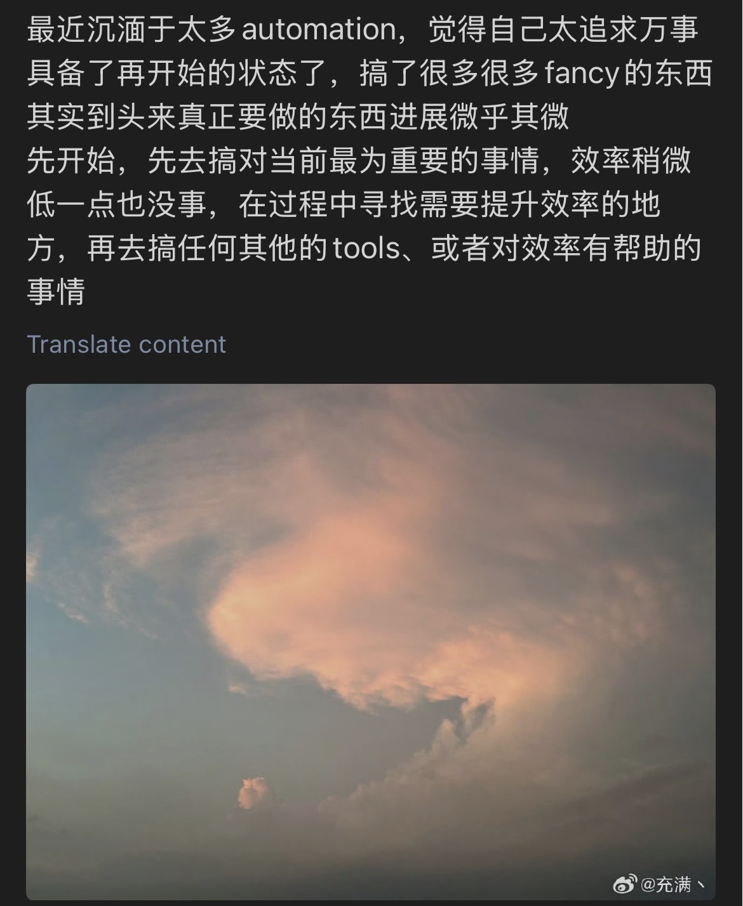

# Reflections

我喜欢自己对新事物的探索性，但是我又时常对自己的这种天性感到苦恼，我给自己mac的绝大多数常用的软件和功能都配了快捷键，我搞了Alfred workflow/Thor Launcher/Espanso/…，只为了在启动软件或者功能甚至是快速打出某一串字符的时候能快那么几秒，我在微博给自己写我很苦恼自己沉湎于太多自动化的东西，可能为了做某件事情的时候快那么几秒花去一整个下午甚至好几天的时间，觉得自己有时候有点舍本逐末。因为这个原因，我不可避免地又自然地转向命令行去处理很多东西，各种快速跳转、检索、正则、shell脚本的function，vim的各种配置，我们每周的组会报告是在一个gitlab的仓库上更新，每个人维护一个自己的markdown文件，本质上就是一个git仓库，正常就是在网页端打开，编辑然后更新，但是那个网页端的编辑器很难用，我为了用更舒服地方式编辑，我连上学校的内网，把那个仓库clone下来然后在本地用markdown编辑器编辑，后来我嫌编辑器需要频繁地移动光标，就改用vim，为了在vim端快速地添加markdown标题、代码块、插入图片等，我为我的vim配置了一整套专属于.md文件的快捷键，用于标题跳转、快速加粗、升降标题等级、添加图片、公式等等。做完这些后，发现组会真正要写的内容一字未动。。。（狂补）


## 2025.07

想做一个能在命令行 work 的 bot，不同于基于 GUI 的 ** Computer Use Agent ** ，Warp？Claude Code？Gemini-CLI？