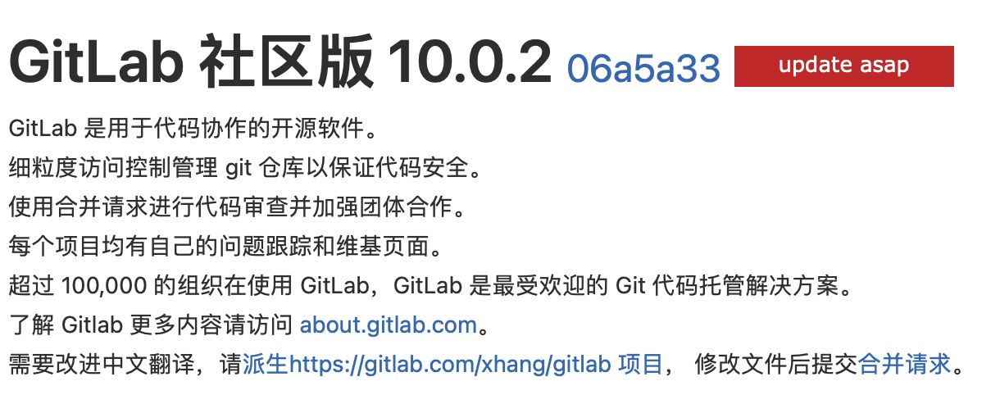
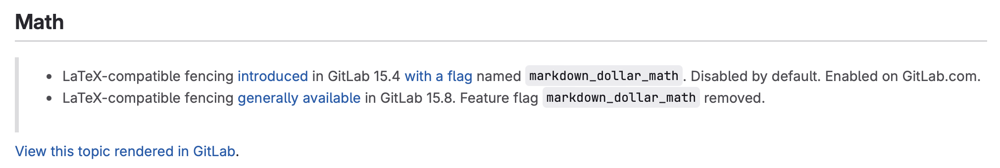

## 9.28 -- 10.11
### 9.28
#### gitlab上无法正常显示公式块（Math Block）

当前gitlab版本：

Math Block被引入的版本：

gitlab更新方式：

https://docs.gitlab.com/ee/update/package/

## 10.26 -- 11.1
### Celery

##### Celery 的优势

1. 分布式任务队列
 - 优势：Celery 支持将任务分布在多台机器上，支持分布式架构。Celery 可以在多台服务器上并行处理多个任务，使得任务调度和分发更加高效。
 - 适用场景：大规模、资源密集型任务，或有多个微服务的系统，适合执行复杂、耗时的后台任务，比如生成报告、处理文件、发送批量邮件等。
2. 任务持久化
 - 优势：Celery 可以通过 Redis、RabbitMQ 等消息队列管理任务状态。任务可以在队列中存储，并能够持久化到消息代理中，即使任务失败或服务器重启，也可以重试或重新分配任务。
 - 适用场景：需要记录任务状态、确保任务可靠性和数据持久性的系统，比如财务系统、订单处理系统。
3. 自动重试和错误处理
 - 优势：Celery 支持自动重试机制，并且可以捕获任务执行中的异常，允许指定任务的重试次数、延迟等，避免因短期异常导致任务失败。
 - 适用场景：对于可能因为网络或其他系统不稳定而失败的任务（例如，外部 API 调用、数据库操作），使用 Celery 重试可以保证更高的任务完成率。
4. 定时任务
 - 优势：Celery 可以使用 celery beat 定时调度器运行周期性任务，这对需要定时执行的任务（如定时报告生成、批量数据处理、日志清理）非常有用。
 - 适用场景：需要每天、每小时或其他固定周期执行的任务管理。
5. 更易管理的任务监控
 - 优势：Celery 提供了任务状态跟踪和监控工具，可以实时查看任务执行情况、队列状态和失败原因，方便开发和运维。
 - 适用场景：对任务完成情况有监控需求的系统，如监控异步任务的进度、统计任务执行的效率和状态。

------

