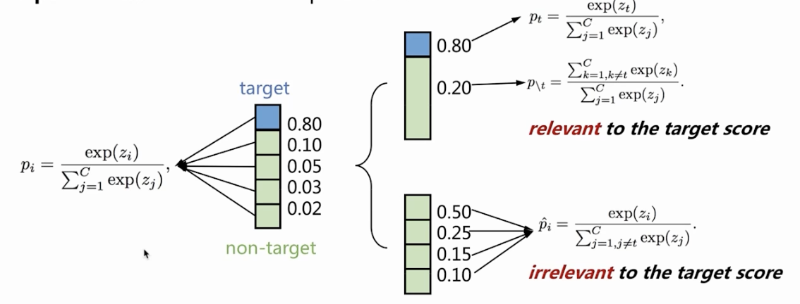
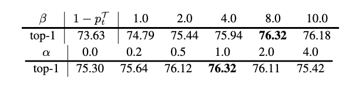
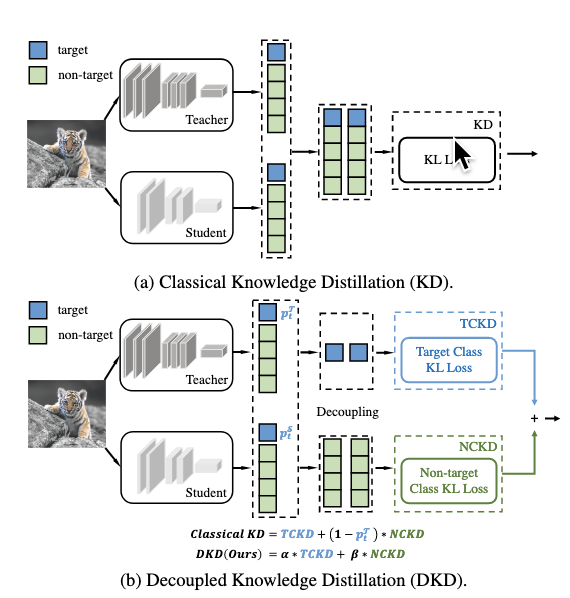
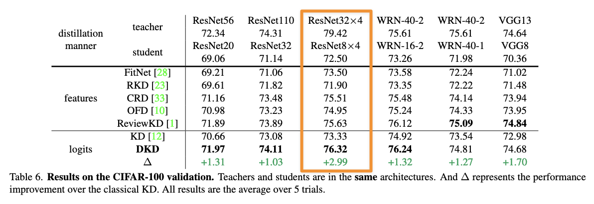
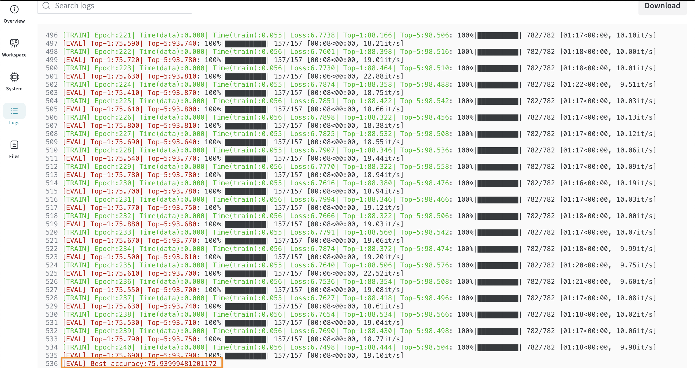

## 9.14 -- 9.20
#### 边缘蒸馏

**边缘蒸馏**（Edge Distillation）是知识蒸馏的一个分支，专门用于优化边缘设备上的机器学习模型。边缘设备通常指资源有限的设备，如智能手机、物联网设备或嵌入式系统。其主要目标是将大型复杂的模型（通常是在服务器上训练的）蒸馏为更小、更高效的模型，从而能在这些设备上运行，而不会显著影响性能。

##### 边缘蒸馏的最新进展（SOTA）

1. **知识蒸馏基础**：

传统的知识蒸馏将大型预训练的“教师”模型中的知识传递给较小的“学生”模型。教师模型通常在大型数据集上进行训练，计算资源消耗较高，而学生模型则设计得更加轻量化，适合部署在边缘设备上。学生模型不仅从真实标签中学习，还从教师模型的软标签（概率预测）中学习，以捕获更多信息。

2. **模型压缩与蒸馏**：

边缘蒸馏主要利用知识蒸馏技术压缩模型，使其适合在实时环境下进行推理。例如，**TinyML**、**量化感知训练**、**剪枝**等技术通常与知识蒸馏结合使用。TinyML专注于为微控制器开发极高效的模型，而量化技术通过降低模型权重的精度（如从32位浮点数降为8位整数）来减少计算复杂度，剪枝则是通过去除冗余参数来减小模型规模。

3. **在线知识蒸馏**：

在某些情况下，会使用**在线知识蒸馏**，即教师和学生模型同时进行训练。这种动态过程可以帮助设备在本地进行实时优化，特别适用于需要频繁更新或根据本地数据流进行个性化的模型。

4. **跨层和多任务蒸馏**：

高级方法不仅限于基本的知识蒸馏。**跨层蒸馏**将教师模型中某些特定层的知识转移到学生模型的相应层，保留特征表示。**多任务蒸馏**允许通过共享的骨干架构将不同任务（如目标检测和分类）的知识一起蒸馏，从而提高模型的通用性。

5. **去中心化与联邦学习中的边缘蒸馏**：

在涉及多个边缘设备的场景中，**联邦学习**可以与蒸馏结合使用。在联邦学习中，多个边缘设备共同训练一个共享模型，但不会交换原始数据。**联邦蒸馏**允许每个设备从全局模型中本地蒸馏知识，然后将其转移到紧凑模型上使用。这有助于解决数据隐私问题并减少带宽消耗。

6. **神经结构搜索（NAS）优化边缘模型**：

神经结构搜索（NAS）用于自动寻找最适合边缘设备的模型架构。当NAS与蒸馏结合使用时，可以为学生模型设计出更符合边缘硬件约束的架构，同时保留教师模型的性能。

7. **延迟感知和节能蒸馏**：

在边缘应用中，延迟和功耗是关键问题。**延迟感知蒸馏**会在蒸馏模型时考虑推理速度和准确性之间的权衡。**节能蒸馏**则专注于不仅使模型更小，而且优化其功耗，延长边缘设备的电池寿命。

##### 主要挑战

1. **异构硬件**：边缘设备的硬件种类繁多（CPU、GPU、内存等），这使得蒸馏技术难以在不同平台上广泛适用。

2. **实时性要求**：边缘应用通常需要实时或接近实时的性能，因此模型需要在不显著降低准确性的情况下具备极低的延迟。

3. **数据隐私和安全性**：由于许多边缘设备运行在敏感环境中（如医疗、个人助理），确保训练和推理中的数据隐私至关重要，这也是联邦学习与去中心化蒸馏技术兴起的原因之一。

##### 最新进展

•	**DistilBERT**和**TinyBERT**等模型应用蒸馏技术压缩了Transformer模型，使其适用于边缘设备上的NLP任务。

•	**YOLO（You Only Look Once）**模型也经过蒸馏，用于在边缘设备上执行快速的实时目标检测，平衡了精度与速度。

##### 应用场景

1. **智能手机**：优化模型用于实时应用，如图像识别、语音助手、增强现实等。

2. **物联网设备**：用于预测性维护、异常检测和环境监测的轻量化模型。

3. **自动驾驶**：帮助处理本地传感器数据，减少依赖云端通信做出关键决策。

4. **医疗穿戴设备**：在健康监测设备中应用高效模型，用于连续监测和预测分析。

##### 总结

边缘蒸馏的最新进展结合了传统的知识蒸馏、联邦学习、神经架构搜索（NAS）和能耗优化等技术，致力于在精度、延迟和效率之间取得平衡，帮助模型在实际场景中适应各种边缘设备的资源限制。


## 9.21 -- 9.27
### 9.22

重读了一遍`Distilling the Knowledge in a Neural Network`

理解了**多分类交叉熵损失函数**、**蒸馏的温度（softmax-tempertarure）**等概念的逻辑，理解了**soft loss与hard loss**的区别与其各自的意义。

### 9.23 -- 9.27
#### Decoupled Knowledge Distillation

##### Intro

近年来 SOTA的蒸馏方法多基于 CNN 的**中间层特征（即Feature）**，而基于**输出 logits** 的方法被严重忽视了。本文将研究重心放回到 logits 蒸馏上，对 7 年前 Hinton 提出的**知识蒸馏方法（KD）**进行了解耦和分析，发现了一些限制 KD 性能的重要因素，进而提出了一种新的方法**解耦知识蒸馏（Decoupled Knowledge Distillation, DKD）**，使得 logits 蒸馏重回 SOTA 行列。同时，为了保证复现和支持进一步研究，该研究提供了一个全新的开源代码库 MDistiller，该库涵盖了 DKD 和大部分的 SOTA 方法，并不断进行更新维护。

##### 定义符号

- 正常的概率估计（softmax）

$$
p_i=\frac{\exp(z_i)}{\sum_{j=1}^C\exp(z_j)}
\tag{1}
$$


- 拆解后的二分类概率分布（目标类和非目标类）

  $p_t$为目标类的概率分布，$p_{\setminus t}$为非目标类的概率分布

$$
\mathbf{b}=[p_t,p_{\setminus t}],p_t=\frac{\exp(z_t)}{\sum_{j=1}^C\exp(z_j)},p_{\setminus t}=\frac{\sum_{k=1,k\neq t}^C\exp(z_k)}{\sum_{j=1}^C\exp(z_j)}
\tag{2}
$$

- 非目标类内部竞争的多分类分布$\hat{p}$

$$
\hat{p}_i=\frac{\exp(z_i)}{\sum_{j=1,j\neq t}^C\exp(z_j)}
\tag{3}
$$



##### 重新推导KD Loss

- **KD的Loss原始定义**如下（本质上是KL散度）

$$
\begin{aligned}
\text{KD}& =\mathrm{KL}(\mathbf{p}^{\mathcal{T}}||\mathbf{p}^{\mathcal{S}}) \\
&=p_t^{\mathcal{T}}\log(\frac{p_t^{\mathcal{T}}}{p_t^{\mathcal{S}}})+\sum_{i=1,i\neq t}^Cp_i^{\mathcal{T}}\log(\frac{p_i^{\mathcal{T}}}{p_i^{\mathcal{S}}})
\end{aligned}
\tag{4}
$$

- 根据公式（2）和（3），我们可以将其改写为：

$$
\begin{aligned}
\text{KD}& =p_{t}^{\mathcal{T}}\log(\frac{p_{t}^{\mathcal{T}}}{p_{t}^{\mathcal{S}}})+p_{\setminus t}^{\mathcal{T}}\sum_{i=1,i\neq t}^{C}\hat{p}_{i}^{\mathcal{T}}(\log(\frac{\hat{p}_{i}^{\mathcal{T}}}{\hat{p}_{i}^{\mathcal{S}}})+\log(\frac{p_{\setminus t}^{\mathcal{T}}}{p_{\setminus t}^{\mathcal{S}}})) \\
&=\underbrace{p_{t}^{\mathcal{T}}\log(\frac{p_{t}^{\mathcal{T}}}{p_{t}^{\mathcal{S}}})+p_{\setminus t}^{\mathcal{T}}\log(\frac{p_{\setminus t}^{\mathcal{T}}}{p_{\setminus t}^{\mathcal{S}}})}_{\mathrm{KL}(\mathbf{b}^{\mathcal{T}}||\mathbf{b}^{\mathcal{S}})}+p_{\setminus t}^{\mathcal{T}}\underbrace{\sum_{i=1,i\neq t}^{C}\hat{p}_{i}^{\mathcal{T}}\log(\frac{\hat{p}_{i}^{\mathcal{T}}}{\hat{p}_{i}^{\mathcal{S}}})}_{\mathrm{KL}(\hat{\mathbf{p}}^{\mathcal{T}}||\hat{\mathbf{p}}^{\mathcal{S}})} \\
&=\underbrace{\mathrm{KL}(\mathbf{b}^{\mathcal{T}}||\mathbf{b}^{\mathcal{S}})}_{{=:\mathrm{TCKD}}}+\underbrace{(1-p_t^{\mathcal{T}})\mathrm{KL}(\hat{\mathbf{p}}^{\mathcal{T}}||\hat{\mathbf{p}}^{\mathcal{S}})}_{{=:\mathrm{NCKD}}}.
\end{aligned}
\tag{5}
$$

​	研究将第一项中的KL散度命名为**目标类别知识蒸馏（Target Class Knowledge Distillation, TCKD）**，将第二项中的KL散度命名为**非目标类别知识蒸馏（Non-target Class Knowledge Distillation, NCKD）**。

##### 实验

单独用TCKD、NCKD作为学生模型的训练数据的消融实验和加入噪声等方法做了一系列启发式实验。

**结论：TCKD 和 NCKD 都有自己的重要作用，然而，研究注意到了在原始的 KD Loss 中，TCKD 和 NCKD 是存在不合理的耦合的**

##### 启发

1. NCKD和$1-p_t^{\mathcal{T}}$高度耦合，会导致高置信度样本的蒸馏效果大打折扣；
2. TCKD 和 NCKD 是耦合的。然而这两个部分传递的知识是不同的，这样的耦合导致了他们各自的重要性没有办法灵活调整。

根据推导和启发式探索，该研究提出了一种新的 logits 蒸馏方法**解耦知识蒸馏（DKD）**，来解决上面提出的两个问题。DKD 的 Loss 表达式如下：
$$
\mathrm{DKD}=\alpha\mathrm{TCKD}+\beta\mathrm{NCKD}
\tag{6}
$$




##### 测试结果

测试了不同数据蒸馏方法在CIFAR-100上的准确率，



##### 复现



------

## 9.28 -- 10.11
### 10.8

看了一篇新的知识蒸馏综述

##### A Survey on Knowledge Distillation of Large Language Models, 2024

<u>在LLM时代之前</u>，知识蒸馏技术主要集中于将知识从复杂、通常繁琐的神经网络转移到更紧凑、更高效的架构。相比之下，LLM的出现彻底改变了知识蒸馏的格局。当前LLM的知识蒸馏时代**将焦点从单纯的架构压缩转移到更细致的知识获取和转移过程**。<u>当前基于LLM的知识蒸馏的重点</u>是提取和转移这些模型所发展的丰富、细致的理解。这种现代方法的关键在于启发式和精心设计的prompts。

## 3.1 -- 3.7
#### [论文] **MiniLLM: Knowledge Distillation of Large Language Models** 

> 近来有很多尝试做LLM的蒸馏的文章都提到说，使用Reverse KL会比Forward KL好，并且给出了自己的理由，事实真的是这样吗，本周我学习了这方面的基础理论知识并进一步对此进行讨论。

$$
D_{KL}(P\|Q)= 
\sum_{x\in X}\left[P\left(x\right)log\frac{P\left(x\right)}{Q\left(x\right)}\right]
\\
=\mathbb{E}_{x\sim P}\left[\log\frac{P(X)}{Q(X)}\right] \\
=\mathbb{E}_{x\sim P}[-\log Q(X)]-\mathcal{H}(P(X))
$$


#### FKL vs RKL

KL散度在知识蒸馏KD中有广泛应用，也广为大家所使用。不过，KL散度并不是对称的，正向KL不等于反向KL。也就是说，用最小化正向KL散度和用最小化逆向KL散度作为模型的优化目标并不是一个等价的条件。准确地来说在过程上不等价，在达到最优化的结果上是等价的。

1. Minimizing the forward KL: $\arg\min_\theta D_{KL}(P\|Q_\theta)$ 
2. Minimizing the reverse KL: $\arg\min_\theta D_{KL}(Q_\theta\|P)$

[机器学习中的KL散度基础](https://link.zhihu.com/?target=https%3A//dibyaghosh.com/blog/probability/kldivergence.html) 


##### FKL: Mean Seeking

极小化前向KL代价下的拟合行为特性：寻找均值


##### RKL: Mode Seeking

极小化逆向KL代价下的拟合行为特性：寻找模态


##### 二维示例


#### RKL = Reinorcement Learning

在MiniLLM的最后，作者提出，这种RKL其实类似于强化学习的IRL（逆向强化学习）。

$$
\begin{aligned}&\arg\max_\pi\mathbb{E}_{\tau\sim Q_\pi}[\log P(\tau)]+\mathcal{H}(Q_{pi}(\tau))\\&=\arg\max_\pi\mathbb{E}_{\tau\sim Q_\pi}[\sum_{t=1}^Tr(s_t,a_t)]+\mathbb{E}_{\tau\sim Q_\pi}[\sum_{t=1}^T-\log\pi(a_t|s_t)]\\&=\arg\max_\pi\mathbb{E}_{\tau\sim Q_\pi}\left[\sum_{t=1}^T\left(r(s_t,a_t)-\log\pi(a_t|s_t)\right)\right]\end{aligned}
$$

#### ChatGPT 给出的两者的内在联系

在传统的知识蒸馏中，我们通常通过最小化目标模型（学生模型）与教师模型输出之间的KL散度来进行训练，目的是让学生模型尽可能地模仿教师模型的行为。这一过程类似于强化学习中的“策略优化”，其中教师模型的输出可以看作是一种策略（即教师模型在某个状态下的行为分布），而学生模型通过最小化KL散度来学习该策略。

具体来说：

1.	KL散度和策略的类比：
在强化学习中，策略是一个关于状态的概率分布，表示在某个状态下采取不同动作的概率分布。知识蒸馏中，学生模型学习的是教师模型的输出分布，实际上可以视为学生模型在学习一个“策略”，即如何模仿教师模型在不同输入下的输出。

2.	训练目标的相似性：
在强化学习中，策略通常通过最大化奖励来优化，而在知识蒸馏中，目标是最小化学生模型与教师模型的输出差异（通常是通过KL散度）。两者都可以看作是在调整模型的行为，使其尽可能地接近一个理想的行为（教师模型的行为或强化学习中的最优策略）。

3.	策略学习的扩展：
如果将学生模型的输出看作是某种“行动”选择的概率分布，那么最小化KL散度的过程就像是在进行策略学习。特别是在强化学习的背景下，KL散度可以用来衡量学生模型和教师模型在不同状态下采取行动的差异。

总结起来，可以将知识蒸馏看作是一种策略学习，特别是当目标是让学生模型模仿教师模型的行为时。这种观点在强化学习中尤为常见，尤其是在模仿学习的设置中，学生模型通过模仿教师的策略来优化自己的决策过程。

## 3.8 -- 3.14
#### [论文] **Rethinking Kullback-Leibler Divergence in Knowledge Distillation for Large Language Models**

直觉来说, 对于FKL与RKL，loss=0都等价于P与Q重叠，最终的优化目标的都是Q与P一致。

#### 既然最终目标一致，那么区别是什么呢？

区别在于拟合过程，FKL优先拟合P概率比较大的区域，也就是head part，RKL优先拟合P概率比较小的区域，也就是tail part：


这篇文章基于这个特性，还提出了新的方法，我还没好好看完。

实际的蒸馏还是更复杂的。每个sample可能只梯度下降一次，并不会如小样本数据集一样优化得很频繁。此外就是蒸馏会看很多样本，并不是单个样本。很多理论的分析，好像与实际上都会有出入。不过，RKL更适合LLM的KD这件事，似乎是是不一定成立的，其本身波动还是很大的。

此外，这种特性也不仅仅局限于LLM的KD，对于常规的KD也是这样。好像大家在做KD的时候，很多都是FKL试试，RKL试试，FKL+RKL的策略试试，JS散度的策略试试。更有效的方法还需要进一步的探索。

#### [论文] **SinKD: Sinkhorn Distance Minimization  for Knowledge Distillation**

之所以提出新方法，主要是现有的知识蒸馏（KD）方法都有各自的局限性：

> 当两个模型的输出差异较大时，它们就不太管用了。

- **KL散度** : 会导致模式平均，学生模型的输出变得过于平滑，涵盖了教师的整个支撑集，失去了区分性
- **RKL散度** : 会引起模式塌陷，学生仅关注教师分布中高概率的显著区域，而忽视了其余部分，不能很好地模仿教师模型
- **JS散度** : 会产生模式低估，由于惩罚不足，让学生模型低估稀有事件的概率

该研究提出了一种知识蒸馏方法SinKD，**<u>采用Sinkhorn距离作为散度度量</u>**。它不仅解决了KL、RKL和JS散度在极端场景下的局限性，而且避免了计算Wasserstein距离的负担。
此外，研究还提出了一种 batch-wise 的重构方法，从而在高维空间中捕捉跨样本分布的几何复杂性。
最终，通过在两个流行的自然语言处理测试集（GLUE和SuperGLUE）上测试，新方法在编码器、编码器-解码器以及解码器等不同架构的所有类型LLMs上均优于当前的最先进方法。


## 3.15 -- 3.26
#### LLM知识蒸馏与强化学习的联系

它们之间的联系主要体现在以下几个方面：

1.  **目标对齐 (Alignment) 与行为模仿:**
    
    **KD for Transferring Aligned Behavior:** 经过RLHF微调后的大型LLM（教师）通常具有更好的对齐性，但可能仍然很大且推理昂贵。知识蒸馏可以将这种通过RL获得的“对齐后的行为策略”蒸馏到更小的学生模型中。学生模型不仅学习基础语言能力，还学习教师模型经过RL优化后的特定行为模式。**这本质上是将RL优化得到的“策略”通过KD的方式进行传递。**KD可以看作是一种特殊的策略模仿学习。教师模型的输出分布（给定输入的下一个词的概率分布）可以被视为教师的“策略”。学生模型通过最小化与教师策略的散度来学习模仿这个策略。当教师模型本身就是一个经过RL优化的策略时，KD就直接服务于将这个优化策略传递给学生。

3.  **奖励信号与损失函数:**
    
    *   **RL 的奖励信号:** RL依赖外部环境或评估器提供的奖励信号来指导学习。这个信号可能稀疏、延迟或复杂。
    *   **KD 的“奖励信号”:** KD中的损失函数（如KL散度）可以被看作是一种“内在奖励”或“指导信号”。当学生模型的输出分布接近教师模型时，损失小（相当于“奖励”高）；反之，损失大（相当于“惩罚”）。这种指导信号通常比RL的外部奖励更密集、更直接。
    *   **混合奖励信号:** 可以在训练学生模型时结合RL的外部奖励和KD的指导损失。例如，学生模型既要优化任务相关的RL奖励，也要尽量模仿教师模型的输出（通过KD损失）。这有助于稳定RL训练，提供更丰富的学习信号，并继承教师的优点。
    
4.  **探索与利用 (Exploration vs. Exploitation):**
    
    RL需要平衡探索（尝试新的、可能更好的行为）和利用（执行已知的高奖励行为）。对于LLM这样庞大的动作空间（词汇表），探索尤其困难。而在知识蒸馏中教师模型的输出分布为学生模型的“探索”提供了强有力的指导。将KD损失（与预训练教师或某个稳定版本的教师模型进行比较）加入RL目标函数中，可以起到正则化的作用，学生模型倾向于在教师认为概率较高的区域进行“探索”和“利用”，避免了盲目搜索，大大提高了学习效率。这可以看作是教师模型为学生划定了一个更有希望的“策略空间”。

#### LLM知识蒸馏与强化学习交互的例子

**RLHF + KD (最常见的交互模式):**

1. 使用RLHF训练一个大型、强大的基础LLM（如GPT-4规模），使其生成更安全、有用、符合指令的响应。这个优化后的模型成为“教师”。
2. 使用知识蒸馏，训练一个小型LLM（如BERT、GPT-2或某个特定尺寸的模型）来模仿这个经过RLHF优化的教师模型的输出。蒸馏损失（如KL散度）促使学生学习教师的生成偏好和风格。

**用RL优化蒸馏过程 :**

可以训练一个RL智能体来选择最适合用于蒸馏的数据子集。智能体的“动作”是选择一批数据，“状态”是学生模型的当前性能，“奖励”是学生模型在验证集上的性能提升或与教师模型相似度的提高。RL智能体学习选择那些能最大化学生学习效率的数据。RL智能体可以学习动态调整蒸馏过程中的超参数，如温度T或损失权重α。根据学生模型的学习状态（状态）调整参数（动作），以获得更好的最终性能（奖励）。

**KD辅助RL训练 :**

1. **策略正则化:** 在RL的目标函数中加入一项KD损失，让当前正在训练的LLM（学生/智能体）的策略不要偏离一个固定的、性能较好的教师模型（或其自身之前的稳定版本）太远。

   `Total Loss = Loss_RL + β * KL(π_teacher || π_student)`

2. **奖励塑造:** 使用教师模型的输出作为RL奖励的一部分。例如，除了任务本身的奖励外，如果学生生成的词符合教师模型的高概率预测，则给予额外的奖励。这为稀疏奖励的任务提供了更密集的指导信号。

   `Reward_Total = Reward_Task + γ * Similarity(output_student, output_teacher)` (Similarity可以是负的KL散度或其他度量)

3.  **引导探索:** 在RL的探索阶段，不完全随机选择动作，而是根据教师模型的输出概率分布进行采样，或者优先探索教师模型认为可能性较高的动作（词）。

## 4.7 -- 4.12
#### [论文] **ON-POLICY DISTILLATION OF LANGUAGE MODELS:  LEARNING FROM SELF-GENERATED MISTAKES**

由这篇论文展开

1. **on-policy和off-policy的区别以及优缺点**
2. **对JS散度的了解**

#### On-Policy vs Off-Policy

这两个概念其实是从**强化学习（Reinforcement Learning, RL）中借用过来的，指的是数据的生成方式是否和当前模型一致**。当知识蒸馏用于 LLM 时，尤其是在线蒸馏、RLHF（强化学习微调）、或者策略蒸馏（Policy Distillation）场景中，它们的意义也就逐渐明确。

- **On-Policy：学生模型自己生成数据，然后用教师的输出作为目标进行训练。**
- **Off-Policy：使用教师或外部模型生成的数据（prompt、回复），然后训练学生。**

##### Off-Policy Knowledge Distillation

这是最常见、最传统的知识蒸馏方式。

**数据来源**：使用已有的固定数据集（prompt → teacher → output），比如Teacher模型的历史生成数据或人类标注数据

1. **SFT**就不用解释了，一种非常常规的方式。

2. **Supervised KD**是指使用训练数据的output作为答案，将数据拼接后`今天天气如何？很好!`，这作为一条数据输入给模型，假设维度维度为[1,8,35206]，分别表示为batch、seq_len、vocab_size（这里我们假设模型的vocab size为35206）。

   student模型和teacher模型接收这条输入后，经过模型层，输出维度相同的logsits，故维度仍为[1,8,35206]。然后将student和teacher的输出做loss。loss有很多可以选择，论文中采用的是Jensen-Shannon Divergence loss，也就是下面会介绍到的JS散度。

3. **SeqKD** 是指仅输入模型的prompt，使用teacher模型生成output后，然后再重复2中的内容，拼接数据后分别给teacher和student，输出相同维度的logits并进行loss计算。

   `论文原话： trains on output sequences generated by the teacher.can be viewed as supervised FT on teacher-generated outputs.`

**训练方式**：Student 模型拿这些固定数据来拟合 teacher 的输出（通常是 soft label 或 logits）

```text
Prompt: "What is the capital of France?"
Teacher: "The capital of France is Paris."

→ 用这个 pair 来训练 student 模型。
```

- **优点**：容易实现，数据丰富，训练稳定
- **缺点**：学生没参与数据生成，可能学不到老师策略的全貌（欠拟合老师策略）

**对缺点的解释**：使用**固定的数据集**可能会导致**分布不匹配（distribution mismatch）**：即训练阶段，学生模型看到的是**标准答案**或**老师生成的高质量输出序列**，而到了**推理阶段**，学生是**自回归地**生成输出，也就是一步步用自己上一步的输出作为输入生成下一步。这种训练-推理分布不一致的问题，其实是**模仿学习（imitation learning）**中非常常见的问题，叫做**暴露偏差（exposure bias）**。

**举个例子来说明：**

假设训练一个学生模型生成句子：

- 训练阶段，它学的是老师生成的句子片段，比如 `The cat is sleeping on the mat`.，一步步学习如何接着写。
- 但到了推理阶段，它得用自己刚生成的词来继续生成，比如它不小心生成了 `The cat is sleep`，然后模型必须接着这个错误继续生成，就容易越走越偏。

这就是因为它**从没见过自己的输出作为输入的情况**，导致推理时表现不佳。

##### On-Policy Knowledge Distillation

学生自己输出（策略）→ 教师指导 → 学生更新策略。

**数据来源**：学生模型自己采样生成输出（或策略），然后用 teacher 对这些数据进行评分或指导。

- **GKD**： 使用student模型生成output，模型每次更新权重后都会进行output输出，再反馈到训练中。

**训练方式**：强化学习风格，根据 teacher 的输出或打分进行优化。

```text
Student 生成答案："France's capital is Lyon."
额外训练一个奖励模型打分或让Teacher输出："Incorrect. It's Paris."

→ 用这个反馈来优化 student 的策略。
```

- **优点**：学生能在自己行为基础上获得精准反馈，更接近真实部署情况
- **缺点**：训练不稳定，效率低，需要 teacher 实时参与（很像 RLHF）

###### 两种实现方法

1. **KL 散度（或用其它散度）蒸馏（Logits 监督）**

   Student 采样（greedy/temperature decoding），Teacher 对相同输入进行前向传播，输出 logits，最后对两者的 logits 进行 **token-level 的 KL 散度计算**。

   ```python
   loss = KL(student_logits || teacher_logits)
   ```

   要求 teacher 输出与 student 输出的序列长度一致，否则 loss 无法对齐（需使用 teacher forcing）

2. **采样 + 评分（Reward-style）蒸馏**

   类似 RLHF 结构，但不是人类给分，而是 teacher 或 reward model 给分：

   Student 生成多个回答，Teacher 给每个回答打分（即“你刚才应该怎么做”），然后把这些加入训练集，再继续用**策略梯度方法**（如 PPO、RL）优化 student。

   ```python
   reward = teacher(prompt, response)
   loss = -log_prob(response) * reward
   ```

   这种方法无需强对齐 teacher 输出与 student 输出的序列长度，但是训练难度高，需要精心设计 teacher 的打分机制

#### 以deepseek为例进行实验

参考别人的实验。

使用deepseek 7b作为student model，deepseek 33b作为teacher model进行训练。进行代码大模型相关的训练，参考指标为Humaneval。

通过实验可观察到student模型训练后的好坏强依赖teacher模型。

先直接进行知识蒸馏，效果不是很理想，考虑到可能的原因是是teacher model能力并没有太强。

然后数据集上对teacher model进行SFT，然后使用相同数据进行知识蒸馏，结果显示Student模型的到了明显的提升。


## 4.12 -- 4.18
### 强化学习应用在知识蒸馏领域的思路

做了两方面的调研：

1. **使用知识蒸馏作为RL训练的正则化或辅助**

   在对LLM进行RL微调时，为了防止模型遗忘预训练知识或策略崩溃，常常会加入一个KL散度项，惩罚当前策略偏离某个参考策略（如原始预训练模型或蒸馏教师模型）太远。这可以看作是KD思想在RL训练框架内的应用。
   $Objective = RL_{Reward} + β * KL(π_{ref} || π_θ)$
   其中 $π_θ$ 是当前正在优化的学生/智能体策略，$π_{ref}$ 是参考（教师）策略。

   - **代表性工作:**
     - **Training language models to follow instructions with human feedback**(Ouyang et al., OpenAI, NeurIPS 2022 - InstructGPT 论文): 在其RLHF的PPO算法实现中，明确使用了KL惩罚项来约束模型更新，防止其过分偏离原始的预训练模型（GPT-3）。这有助于稳定训练并保留模型的通用语言能力。
     - **大多数基于PPO的RLHF实现：**基本上都沿用了InstructGPT的方法，在RL优化中加入KL散度项作为正则化，这可以被视为一种隐式的策略蒸馏或约束。**Deepseek-R1 的 DRPO 实现**也加入了KL散度项。


2. **使用RL来优化知识蒸馏过程本身**

训练一个RL智能体来做出更好的蒸馏决策。

- **数据选择:** RL智能体学习选择哪些数据点进行蒸馏对学生模型提升最大。
- **动态教师:** RL智能体学习在蒸馏过程中动态地选择或调整教师模型（或教师的输出模式）。
- **自适应蒸馏策略:** RL智能体根据学生模型的学习状态调整蒸馏超参数（如温度T、损失权重α）。


### 粗读了一些论文
#### [论文] Knowledge Distillation for Teaching Symmetry Invariances


#### [论文] Reinforced Multi-Teacher Selection for Knowledge Distillation

##### 动机

1. 多个教师模型（大模型）教一个学生模型（小模型），避免单个教师模型教学生模型，导致bias

2. 当有多个老师时候，学生模型可否根据自己能力和教师特点，选择性进行学习。（假设学生很聪明）

3. 最好的老师不一定教出最好的学生，比如Roberta模型>bert，但是两个模型的学生模型性能却是bert高于Roberta。原因很好理解，大模型善于捕捉细节，但是小模型不一定学会这些。（让一个弱学生，去给一个强大老师去学习，不一定会效果好，可能逐步学习效果会更好）


4. 以往模型中多个教师采用固定权重，每个教师权重不变。而本篇文章中，主要idea是，如何在不同的训练阶段，对不同的样本，给老师设置不同的权重。

##### 方法

1. 强化学习框架：在训练过程中选出最合适的老师，依据是学生在碰到问题后给到的反馈，这是个策略问题，优化策略--->强化学习。
2. `action`：只有两种，选择这个教师模型与不选择； `policy`：以什么样的概率去选择不同的教师模型
3. 在训练过程中，以当前 $\pi$ 选择教师模型，积累到一个batch后，训练学生模型，考察学生模型情况（val），用reward 反馈给 agent。
4. 所以最关键的是`policy`函数 $\pi$ 的学习。学习好策略函数有三个点，特征提取、`reward`的设置，最后一个是`policy`的定义。

